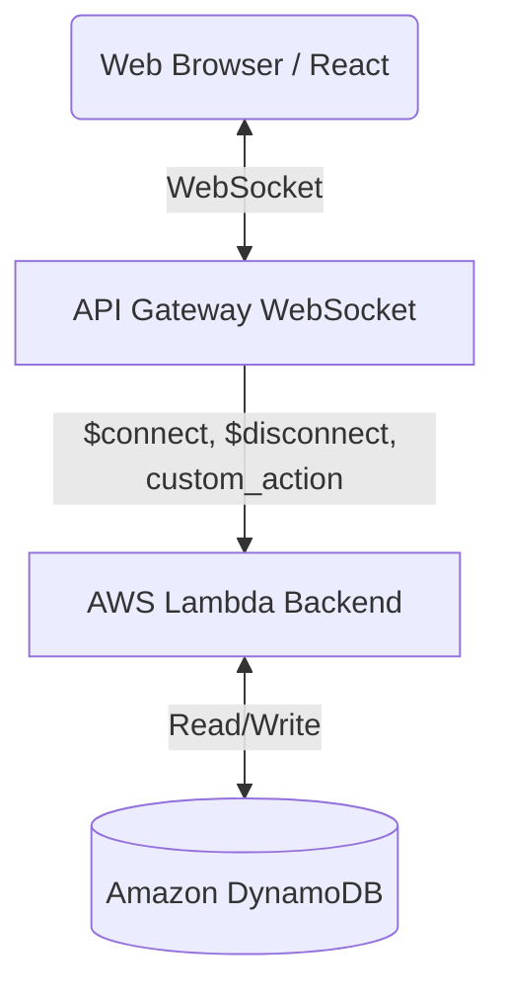

# AWSサーバーレス構成 オンライン対戦ゲーム

## 概要
AWSのFree Tier（無料枠）を最大限に活用し、リアルタイムのオンライン対戦ゲームのバックエンドおよびフロントエンド基盤を構築するプロジェクトです。
ユーザーはルーム（部屋）を作成・参加し、同一ルーム内のプレイヤー同士でリアルタイムに通信を行うことができます。

## アーキテクチャと使用技術
このプロジェクトでは以下の技術スタックを使用します：
- **インフラストラクチャ**: 全て AWS Free Tier 内で構成します。
  - **API Gateway (WebSocket)**: クライアントとバックエンド間のリアルタイム双方向通信。
  - **AWS Lambda (Node.js)**: 接続管理、ルームのビジネスロジック処理。
  - **Amazon DynamoDB**: ルーム情報やユーザー（プレイヤー）のコネクション情報を管理。(`PAY_PER_REQUEST` 課金モードを利用)
  - **AWS CDK (TypeScript)**: AWSリソースをInfrastructure as Codeとして管理。
- **フロントエンド**: Webブラウザ向けのゲーム画面を想定 (React)。

## デプロイ方法
AWSへのデプロイ手順については、[AWS デプロイガイド](docs/AWS_DEPLOYMENT_GUIDE.md) を参照してください。

## アーキテクチャ図


## ディレクトリ構成（モノリポジトリ）
プロジェクトはモノリポジトリ構成を採用しており、大きく3つのディレクトリに分かれています。

```text
.
├── infra/       # AWS CDKコード (IaC管理)
├── backend/     # AWS Lambda関数、ビジネスロジック用コード
└── frontend/    # React (Webブラウザ用ゲーム画面)
```

## 主要機能
- **ルーム管理機能**: 「部屋（ルーム）」の作成・参加・一覧取得機能。
- **リアルタイム通信**: WebSocketを用いた、同一ルーム内プレイヤー間でのリアルタイム同期・通信機能。

## 今後の開発ステップ
1. **バックエンド関数の実装**:
   - WebSocket の接続（`$connect`）、切断（`$disconnect`）、およびカスタムルート（ルーム作成、参加、メッセージ送信等）を処理する Lambda 関数を作成する。
2. **CDKへのLambda統合**:
   - `infra-stack.ts` にて、作成した Lambda 関数をデプロイする設定を追加し、API Gateway (WebSocket) の各ルートに連携する。
   - Lambda関数がDynamoDBテーブルへアクセスできるようIAM権限を付与する。
3. **フロントエンドの実装**:
   - React を使用して、WebSocket サーバーに接続するクライアント画面（ルーム一覧表示、作成、入室、ゲーム画面）を作成する。
4. **統合テスト・動作確認**:
   - フロントエンドからAWS上の WebSocket API に接続し、リアルタイムでの状態同期が正しく動作することを確認する。
